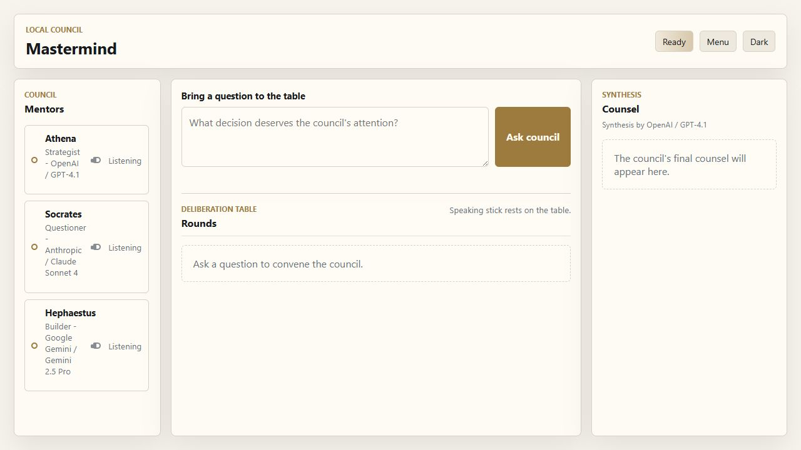
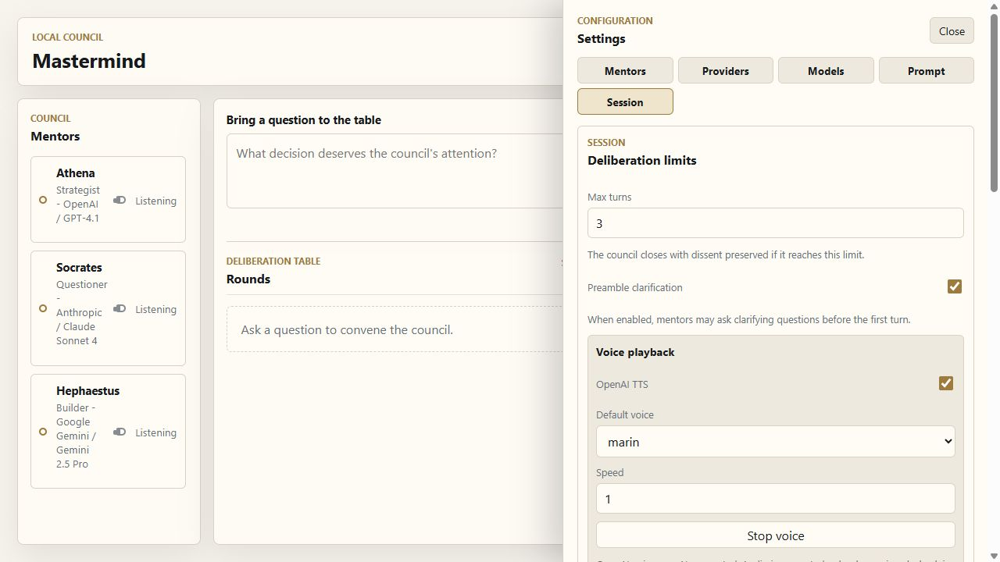

# Mastermind


Mastermind is a local-first web app for consulting a council of LLM mentors. Instead of sending a question to one model, you convene a small group of configurable mentors who deliberate in structured rounds, claim a shared speaking stick, ask clarifying questions, preserve disagreement, and produce a final synthesis.

The product goal is a ceremonial but practical strategy room: different model strengths, personalities, and reasoning styles illuminating the same question without pretending that consensus is always truth.

## Screenshots





## Features

- Live real council experience with token-streamed mentor output.
- Configurable mentors, providers, models, voices, and deep persona profiles.
- Built-in provider catalog for OpenAI, Anthropic, Gemini, OpenRouter, xAI, Groq, Novita, and local mock mentors.
- Custom OpenAI-compatible provider and model entries.
- Optional 1Password references or environment variables for provider API keys.
- Preamble clarification before deliberation, plus automatic ongoing consultation sessions for follow-up questions.
- Structured synthesis with next actions, assumptions, unresolved questions, minority views, and mentor grounding.
- OpenAI TTS playback with per-mentor voice controls and progressive sentence-level playback.
- Local saved consultations, PDF export, JSON backup/import, dark mode, and theme persistence.
- Local server privacy hardening: `127.0.0.1` bind, token-gated secret-backed APIs, and restricted static assets.

## Quick Start

Install from the committed lockfile:

```powershell
npm.cmd ci --ignore-scripts
```

Run the app:

```powershell
npm.cmd run serve
```

Open:

```text
http://127.0.0.1:4173
```

Run tests:

```powershell
node --test
```

PowerShell on some machines blocks `npm.ps1`, so the examples use `npm.cmd`.

## API Keys

Provider keys are configured from the app's Providers tab. You can use ordinary environment variable names such as `OPENAI_API_KEY`, or 1Password references such as:

```text
op://Your Vault/OpenAI API Key/credential
```

For a private local machine, copy:

```text
public/local-secret-defaults.example.json
```

to:

```text
public/local-secret-defaults.json
```

Then put your local vault, account, and item names in that ignored file. It is loaded through a token-protected local endpoint and is not served as a static asset. Resolved API keys stay server-side and should never be committed, logged, exported, or stored in plaintext browser storage.

## Local Data

Mastermind stores user-owned app state in browser localStorage: saved consultations, recent sessions, council presets, current mentors, custom providers, TTS settings, theme, and secret references. Session settings include JSON backup/import controls. Backups preserve references, not resolved API keys, and reject plaintext API-key-looking secret references.

Consultations can also be exported through the browser print-to-PDF flow.

## Development Notes

This repository is developed with Spec Kit and small, test-backed increments. The detailed planning artifacts live under `specs/` and `docs/` for project history, but the README intentionally stays focused on using and understanding the app.

Useful docs:

- [Statement of Work](docs/sow.md)
- [Local Storage Notes](docs/local-storage.md)
- [Voice Synchronization Notes](docs/voice-synchronization.md)
- [Research Notes](docs/reference/mastermind-llm-council-research.md)
- [Public Release Checklist](docs/public-release-checklist.md)

Community files:

- [Contributing Guide](CONTRIBUTING.md)
- [Security Policy](SECURITY.md)

## License

Mastermind is released under the [MIT License](LICENSE).
